## 2 Deep Q-learning

### 2.4 Basic Q-learning
DQN algorithm implementation
- CartPole-v1 eval return
`python cs285/scripts/run_hw3_dqn.py -cfg experiments/dqn/cartpole.yaml`

- LunarLander-v2 eval return over seed 1, 2, 3

- CartPole-v1 with learning rate 0.05(blue) and 0.001(orange)
  1. Predicted Q-values
  
  2. Critic Loss
  
  3. Eval Return
  

    Q values and critic loss seem to be overestimated with learning rate 0.05

### 2.5 Double Q-Learning
#### LunarLander-v2
- eval return(double q learning v.s. policy gradient)
double q learning

policy gradient

  Double q learning is fairly stable compared to PG.

- eval return over seed 1, 2, 3(red: double q learning; blue: q learning)
seed 1

seed 2

seed 3

The reason for the difference might be the output of q values network in double q learning is more stable than the output in q learning.

- MsPacman eval return v.s. train return
eval return

train return

Early in training, eval return is more stable and higher than train return. This is because when sampling an action from the DQN agent, training uses a higher epsilon(1 or 0.5) than the default epsilon(0.02) used by evaluating.

## 3 Continuous Actions with Actor-Critic

 ### 3.1.1 Bootstrapping-Pendulum
 -  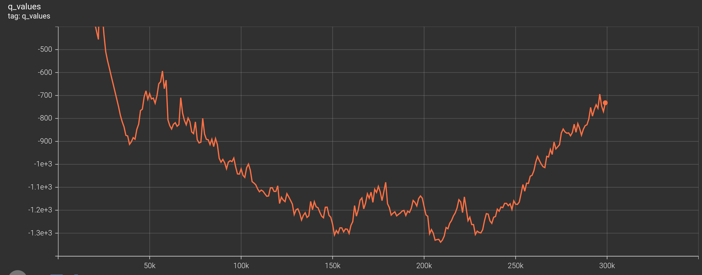
 Q-values stabilize at about 900.

 ### 3.1.3 Actor with REINFORCE
 -  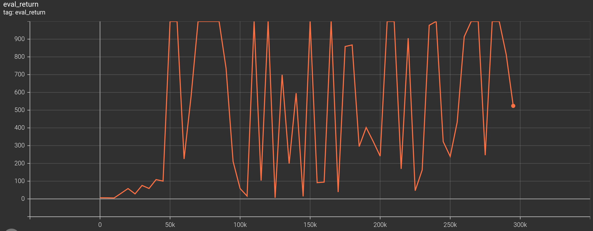
 Eval returns are close to 1000.(Inverted Pendulum)
 -  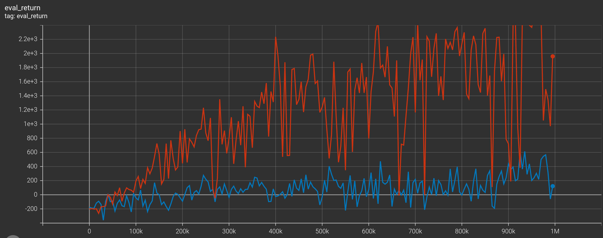
 Using 10 samples(red) to estimate object function has lower variance and gains more returns than just using one sample(blue) to estimate it.(Halfcheetah)

  ### 3.1.4 Actor with REPARAMETRIZE
-  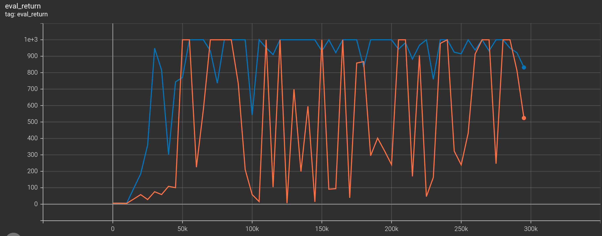
(Inverted Pendulum)  
Both REPARAMETRIZE(blue) and REINFORCE(orange) achieve similar reward and REPARAMETRIZE performs better.
 -  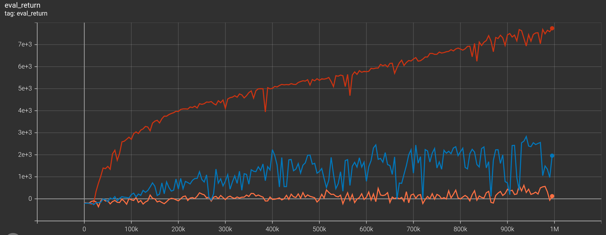
 (Halfcheetah)  
 reparametrize(red) has the best performance compared with reinforcement1(orange) and reinforcement10(blue).
-   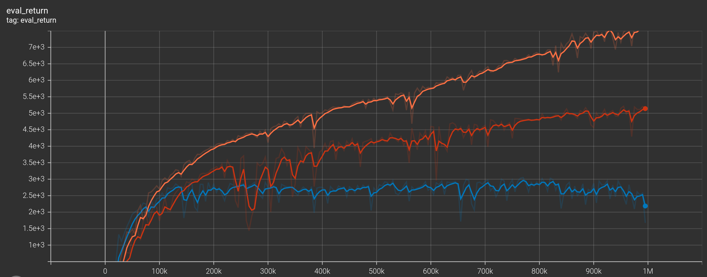
    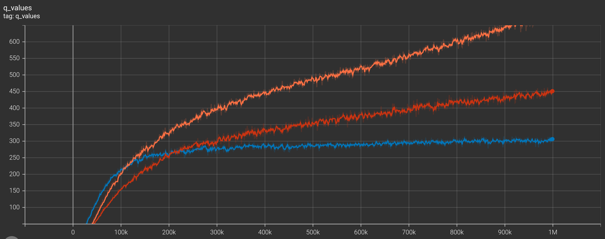
 (Halfcheetah)
Orange: num_critic_updates->1, num_action_samples->1  
Blue: num_critic_updates->10, num_action_samples->1  
Red: num_critic_updates->1, num_action_samples->10  
Both eval_return and qValues are the highest in orange curve.

 -  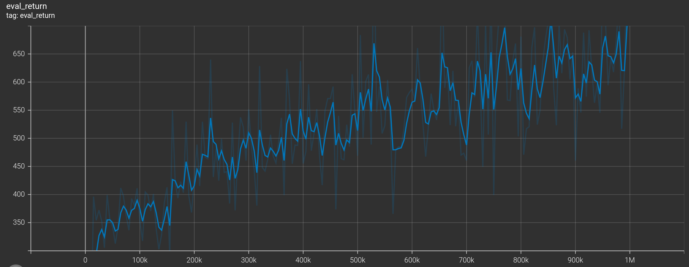

   ### 3.1.5 Stabilizing Target Values
-   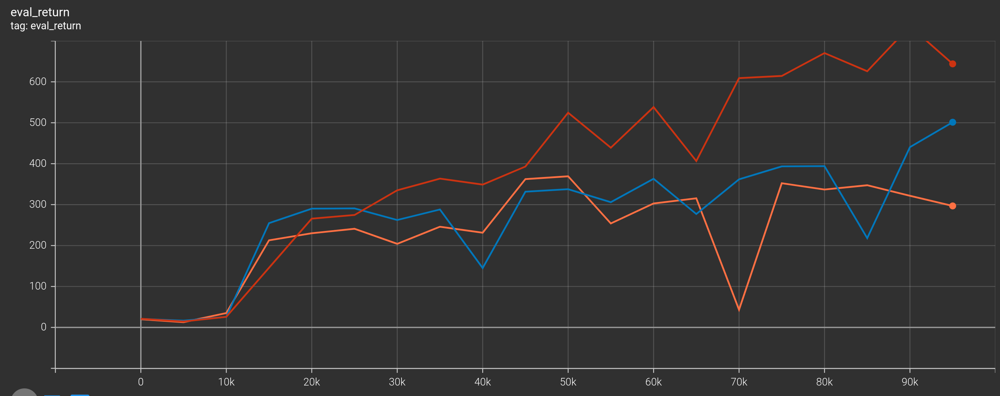
 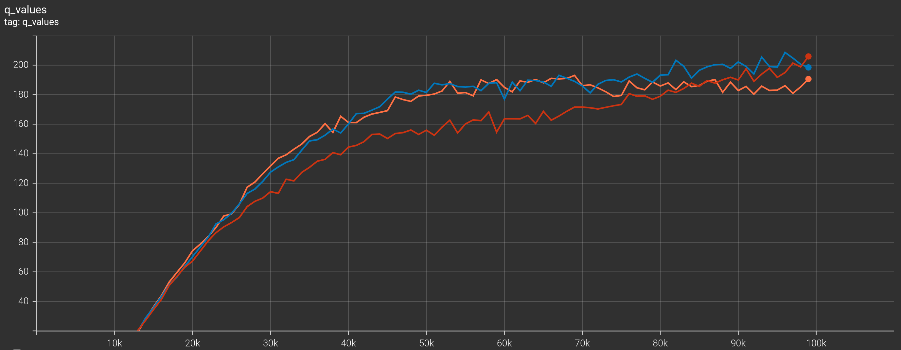
(Hopper)  
clipQ(red) has the best performance and lowest q_values, which means clipq's Q-values has the most accurate estimation. The single-Q(orange)'s performance is the worst, and the most overestimated q-values. doubleQ(blue)'s perforance is medium.
-   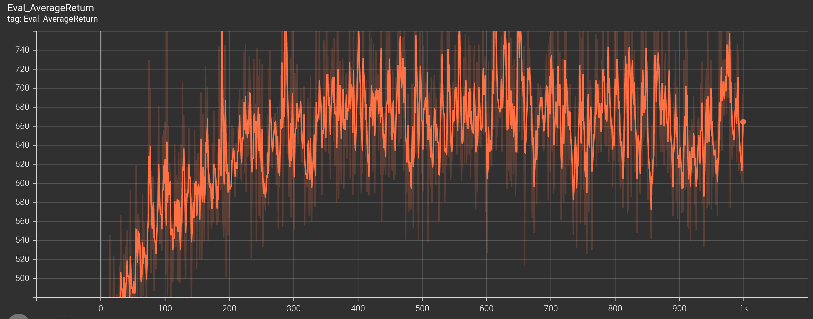
    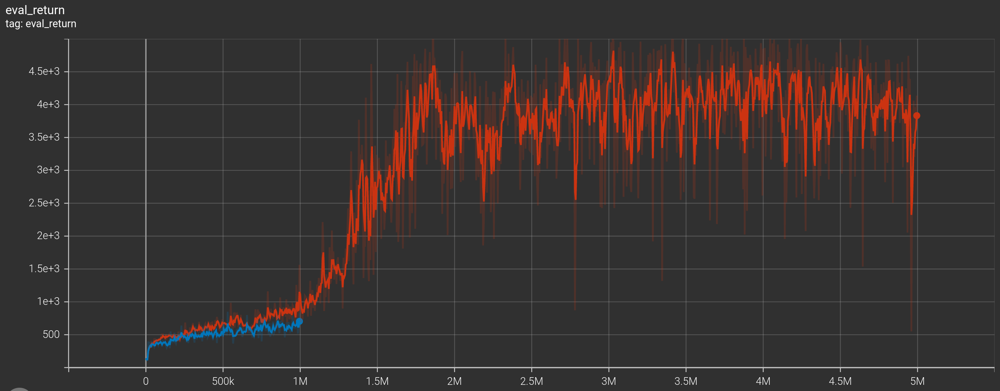
    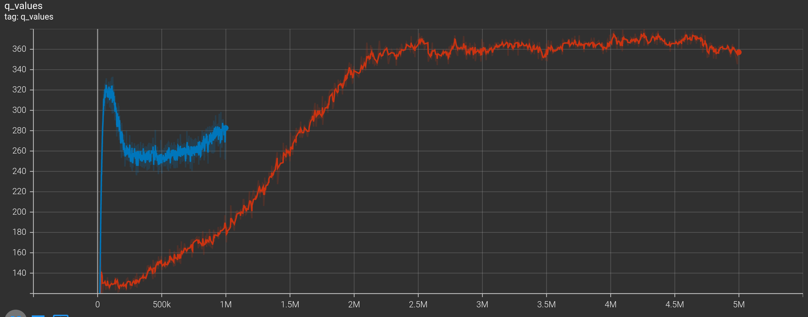
    Orange: Policy Gradient  
    Blue: Reparametrize(mean q values)  
    Red: Reparametrize(min q values)  
    Obviously the performance of the Red curve is much much much better than the others!!!!
    Off-policy algorithm is more effective than on-policy algorithm. In terms of time consuming, off-policy took about 25h while on-policy took about 120h on my laptop.
