## 2 Deep Q-learning

### 2.4 Basic Q-learning
DQN algorithm implementation
- CartPole-v1 eval return
`python cs285/scripts/run_hw3_dqn.py -cfg experiments/dqn/cartpole.yaml`
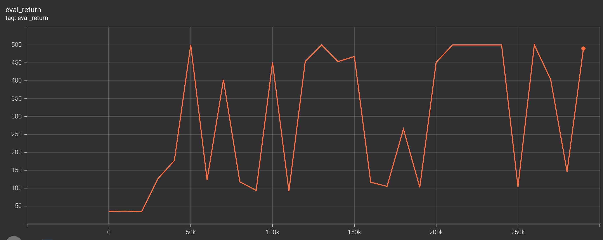

- LunarLander-v2 eval return over seed 1, 2, 3
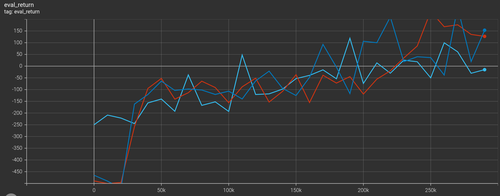

- CartPole-v1 with learning rate 0.05(blue) and 0.001(orange)
  1. Predicted Q-values
  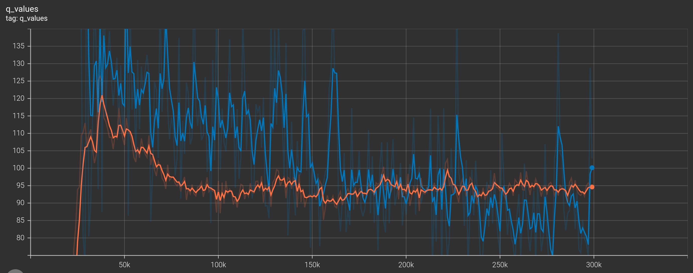
  2. Critic Loss
  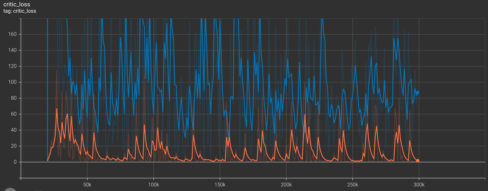
  3. Eval Return
  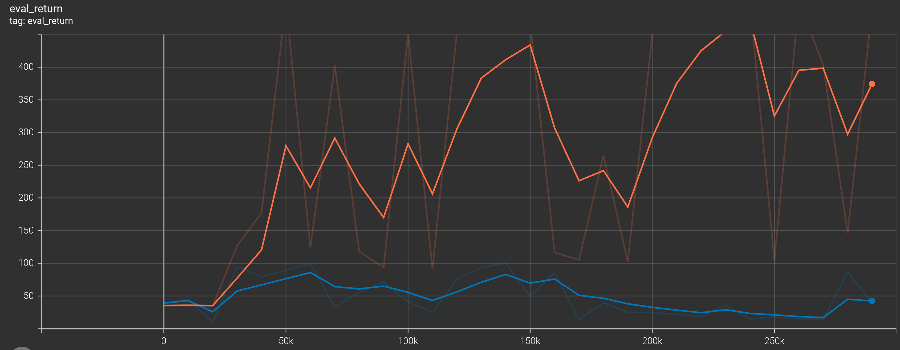

    Q values and critic loss seem to be overestimated with learning rate 0.05

### 2.5 Double Q-Learning
#### LunarLander-v2
- eval return(double q learning v.s. policy gradient)
double q learning
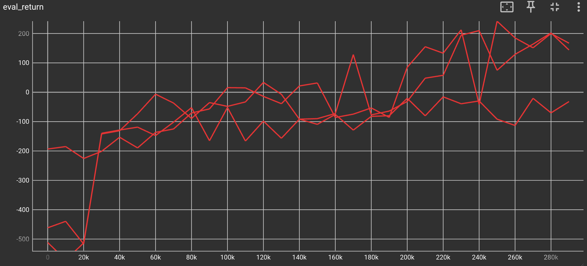
policy gradient
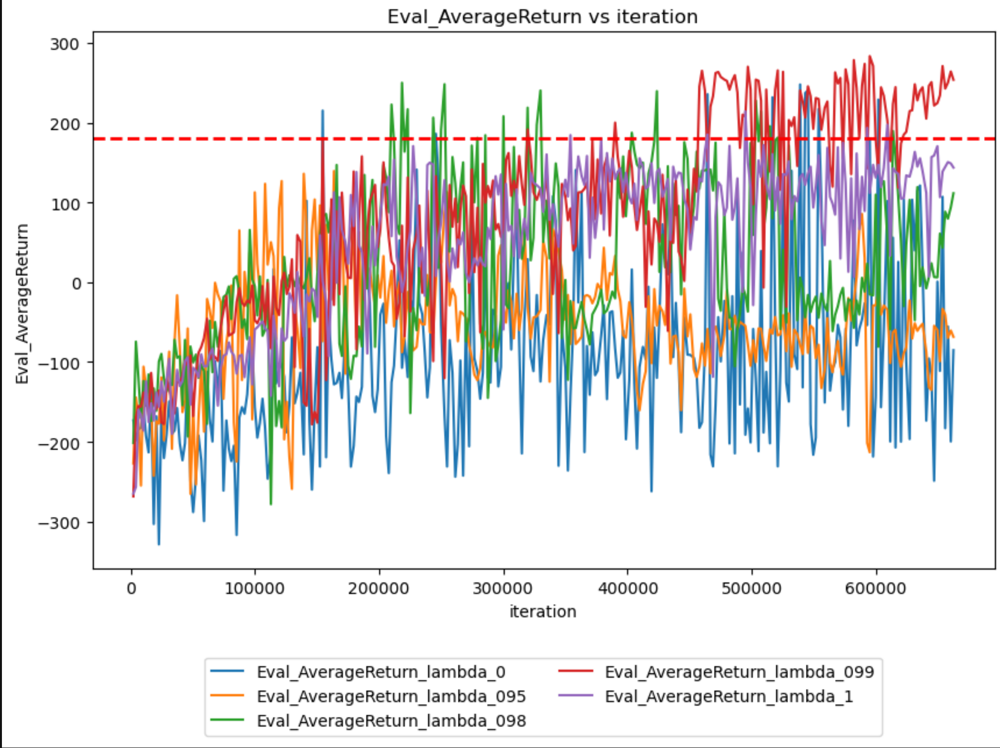
  Double q learning is fairly stable compared to PG.

- eval return over seed 1, 2, 3(red: double q learning; blue: q learning)
seed 1
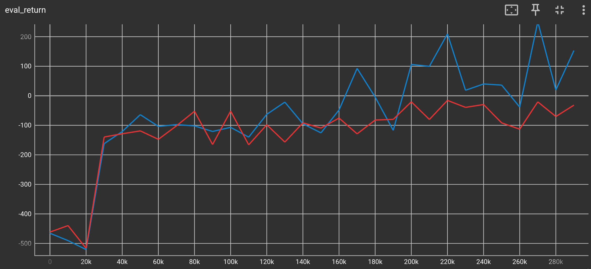
seed 2
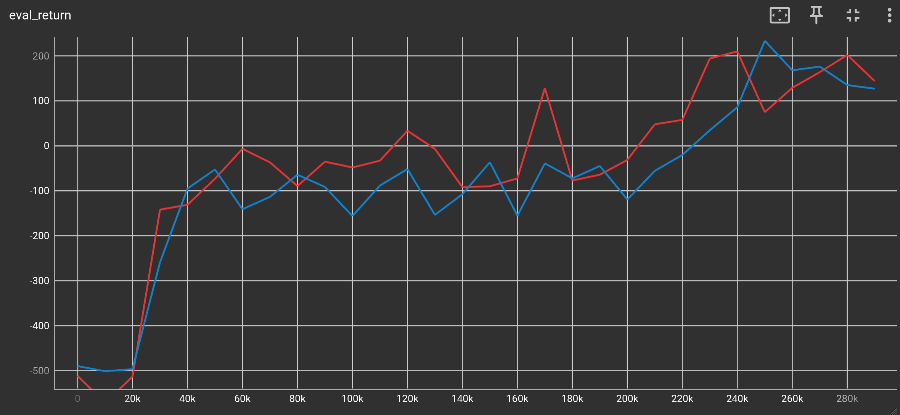
seed 3
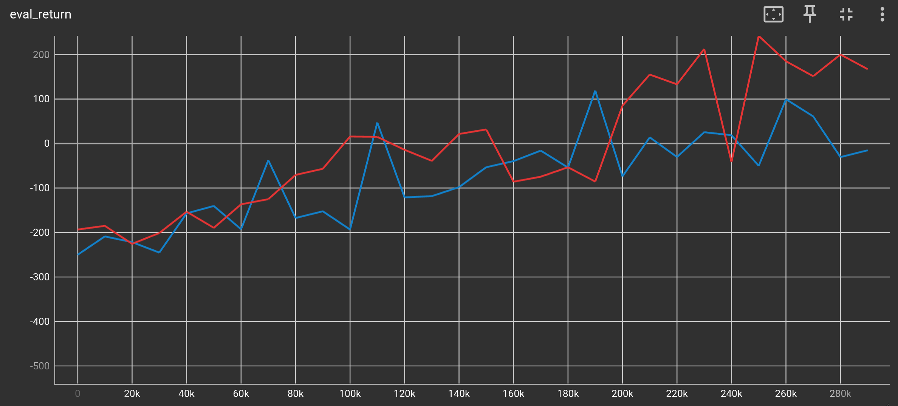
The reason for the difference might be the output of q values network in double q learning is more stable than the output in q learning.

- MsPacman eval return v.s. train return
eval return
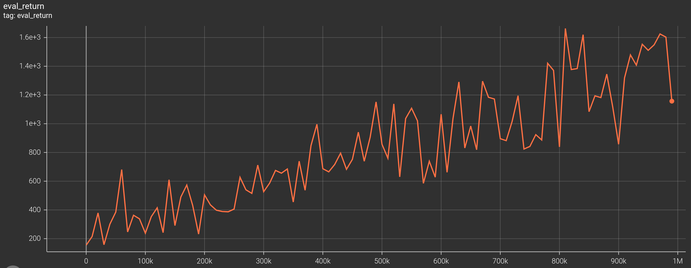
train return
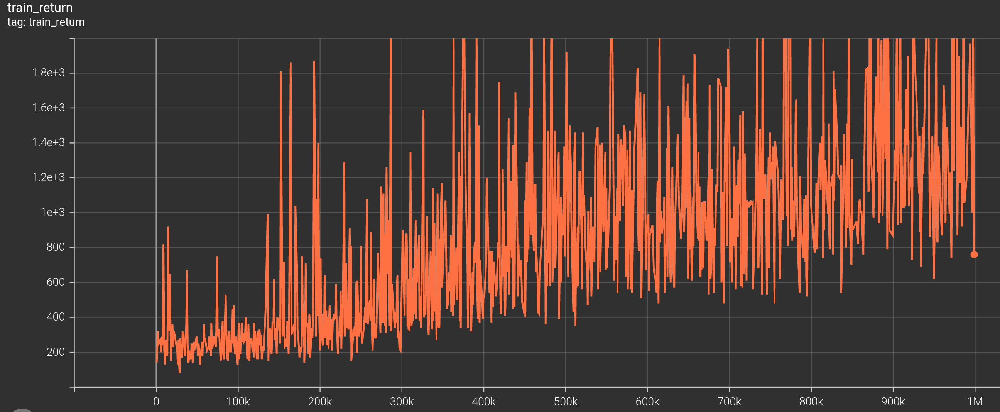
Early in training, eval return is more stable and higher than train return. This is because when sampling an action from the DQN agent, training uses a higher epsilon(1 or 0.5) than the default epsilon(0.02) used by evaluating.