# Model Based RL Algorithms
## Problem 1
- Default hyperparameter
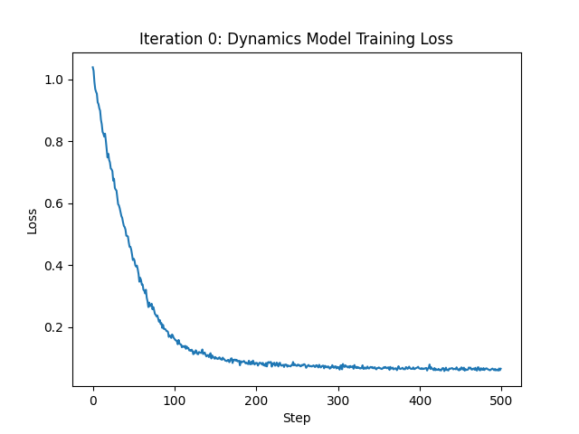
- num_layer:2 hidden_size:64 learing_rate:0.001
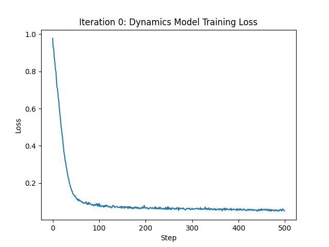
- num_layer:4 hidden_size:128 learing_rate:0.001
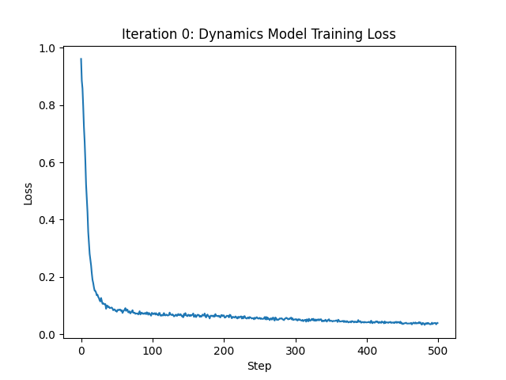
- num_layer:4 hidden_size:128 learing_rate:0.0001
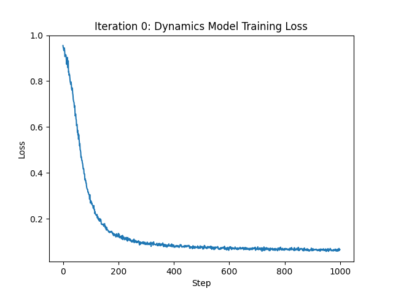
- num_layer:4 hidden_size:128 learing_rate:0.01
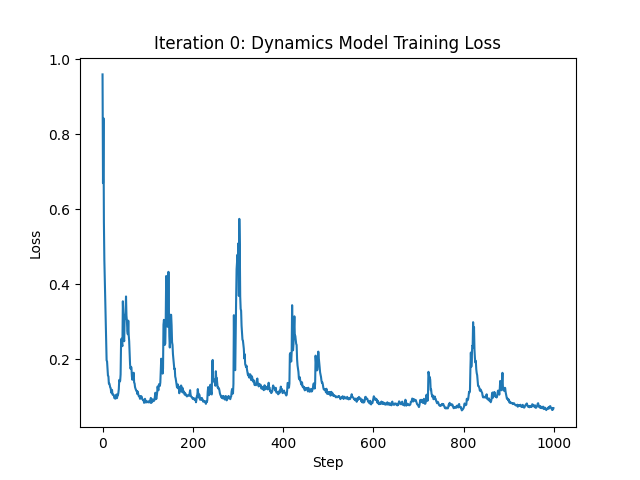

## Problem 2
Average eval return is -44.73, greater than -70 after one iteration.

## Problem 3
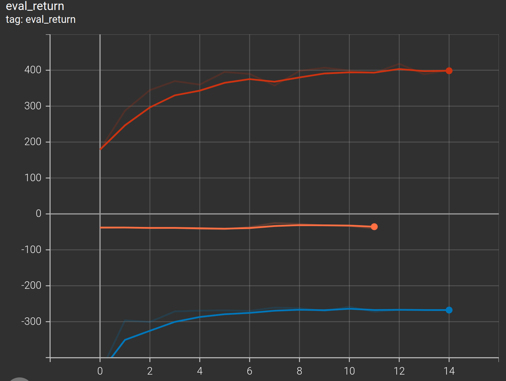
Orange: obstacles  Blue: reacher  Red: cheetah 
All the curves are within the specified range.

## Problem 4
### Effect of ensemble size
- Blue: ensemble size=1  
- Orange: ensemble size=3    
- Red: ensemble size=10
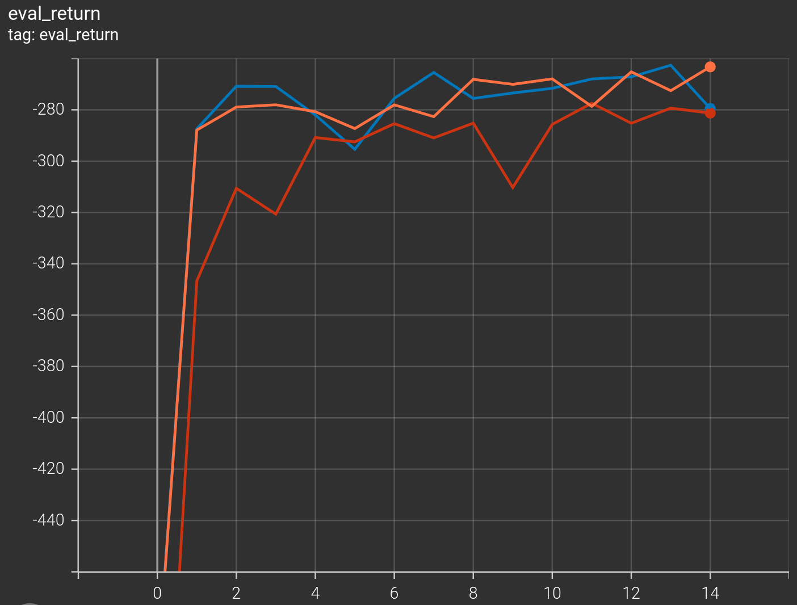
The ensemble size 1 and 3 seems to show the same performance, and the ensemble size 10 is a little bit worse than the other two curves.

### Effect of candidate action sequence
- Red: candidate action sequences=500
- Orange: candidate action sequences=1000  
- Blue：candidate action sequences=2000
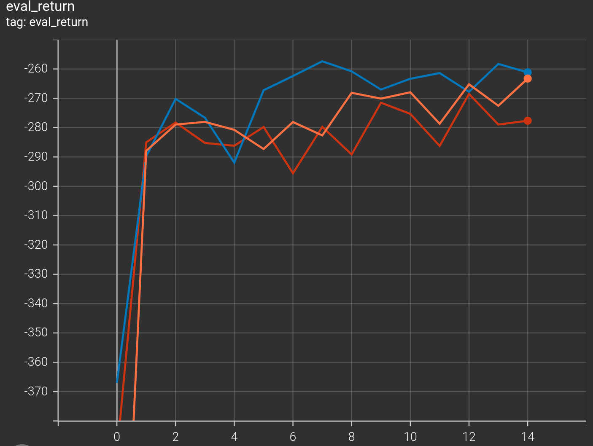
The longer candidate action sequence is, the better performance is!

### Effect of horizon
- Cyan: horizon=3  
- Pink: horizon=5 
- Orange: horizon=10  
- Green: horizon=20
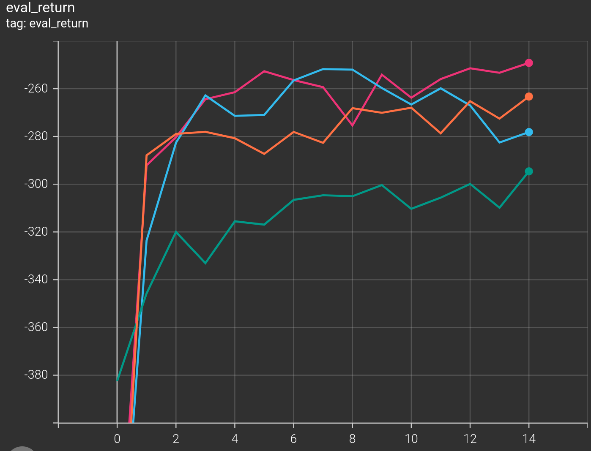
The further we plan into future, the more deviation we have! So horizon 3 and 5 have the best performance in random shooting method.
## Problem 5
- Red: cem iteration=2  
- Cyan: cem iteration=3 
- Blue: cem iteration=4
- Orange: random shooting  
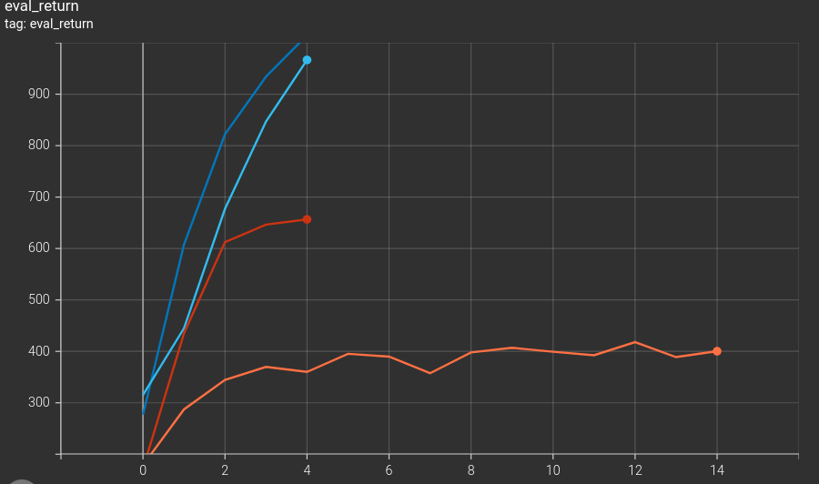
Cem iteration perform much better than random shooting.   
The more cem iteration is, the higher eval return is.

## Problem 6
- Orange: mbpo rollout length=0 
- Blue: mbpo rollout length=1  
- Red: mbpo rollout length=10 
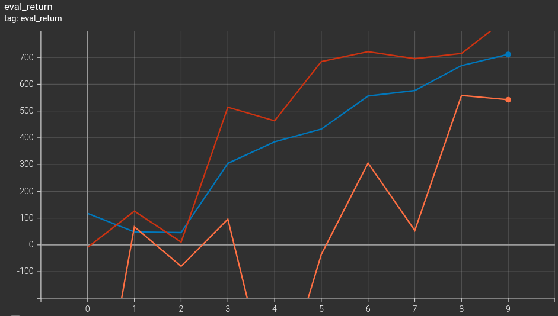

MBPO is better than Dyna, Dyna is better than model-free SAC baseline.

