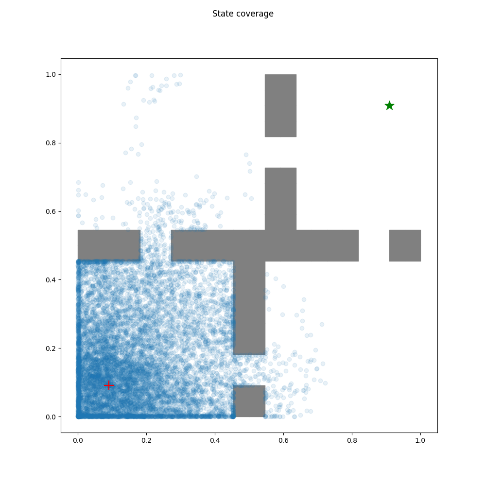
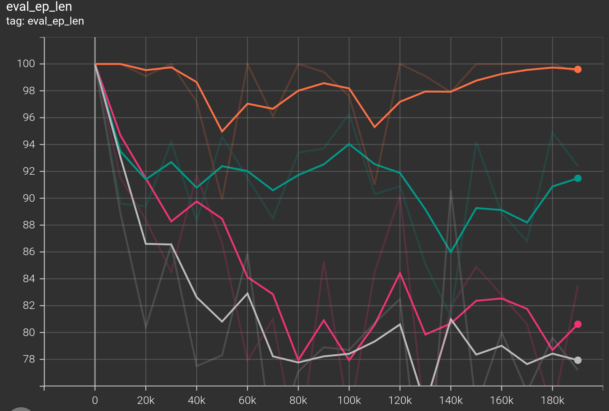
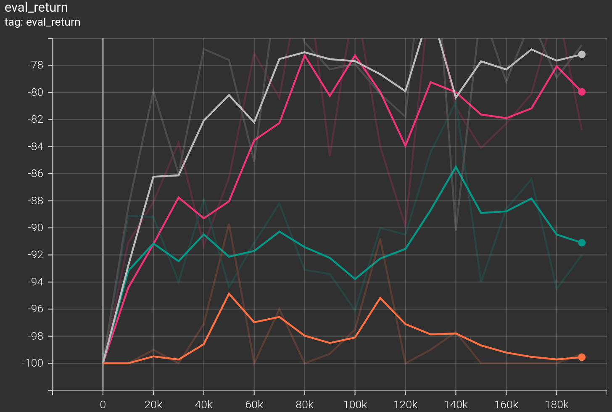
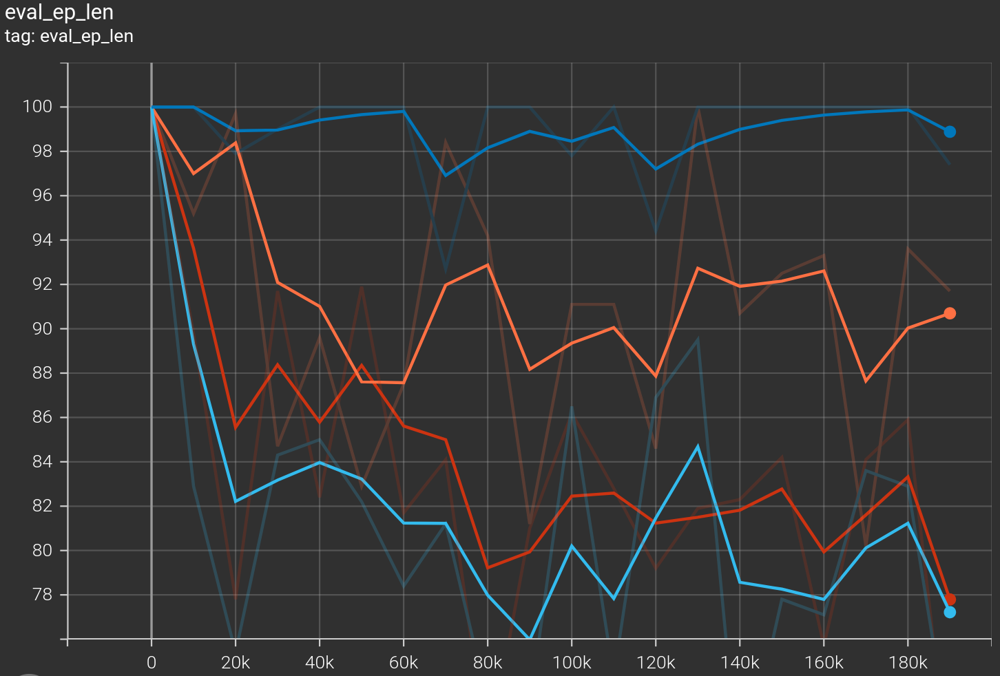
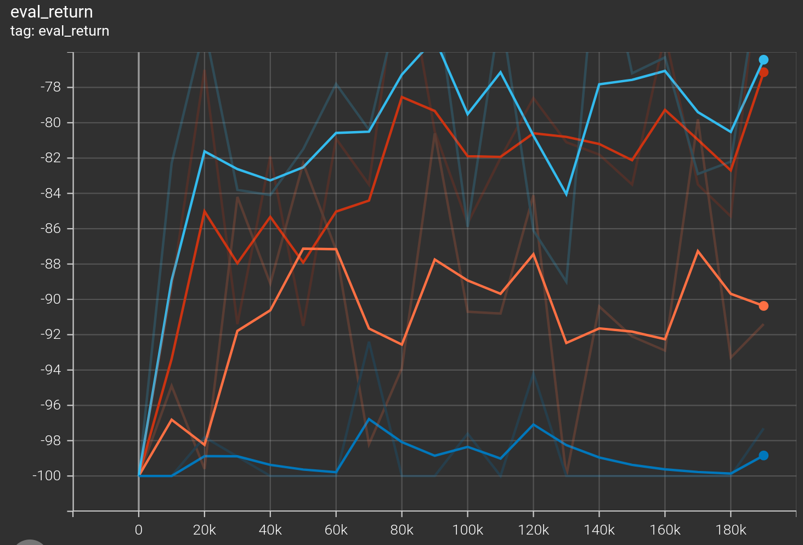
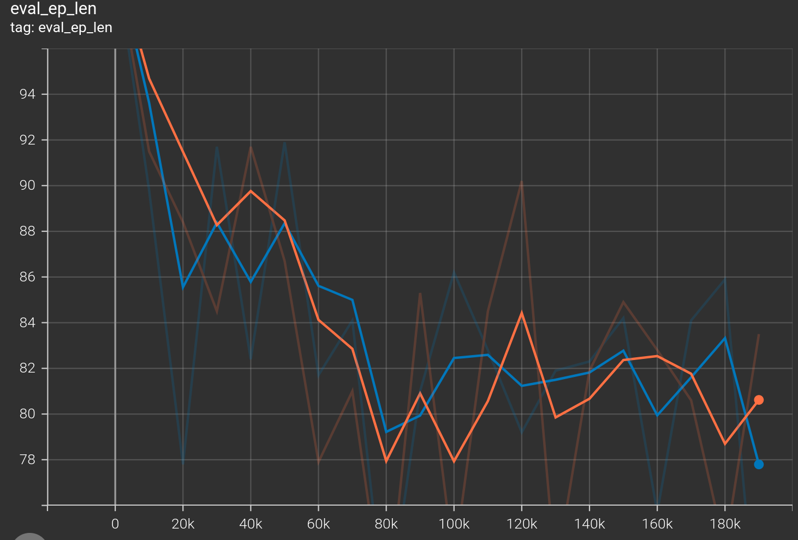

# Exploration Strategies and Offline Reinforcement learning
## Problem1 Exploration
### Random Policy
- Easy environment

- Medium environment

- Hard environment

### Random Network Distillation Algorithm
- Easy environment
  (for plot from up to down)  
  rnd error w/o normalization  
  rnd error w/ normalization  
  rnd error normalization w/ running mean and std  

- Medium environment
  (for plot from up to down)  
  rnd error w/o normalization  
  rnd error w/ normalization  
  rnd error normalization w/ running mean and std  

- Hard environment
  (for plot from up to down)  
  rnd error w/o normalization  
  rnd error w/ normalization  
  rnd error normalization w/ running mean and std  

Summary: Normalization leads to the wider exploration. Using method mean(), std() might allow the agent explore a lot more board states than using running mean and std, but it seems to no obvious difference between them.

## Problem2 Offline RL
### Conversative Q learning
#### Comparison of CQL and DQN

- easy environment  
  orange: CQL  
  blue: DQN

- medium environment  
  cyan: CQL  
  red: DQN

- hard environment  
  green: CQL  
  pink: DQN

Summary： CQL improves eval return a little than DQN does in three environments.

#### Variation on CQL alpha
- alpha = 0.1(default)

In view of all the agents reach the goal on cql alpha 0.1 in Medium environment, I choose to try different cql alpha **in Hard environment** to reveal the effect on cql alpha.
Specifically, I choose cql alpha in [0, 0.1, 0.2, 0.5, 1, 2, 5, 10] sequentially.  

- variation on alpha in hard environment  
offline datasets 10K steps, training_steps: 200000, hidden_size: 64, num_layers: 2 

Summary: The Cyan line and red line have the best performance, with cql_alpha 0.5 and 0.2 respectively. With cql_alpha=0, i.e., DQN is the orange line which is close to the blue line.  

Evaluation trajectories of the red line (alpha=0.2)
 

### Policy Constraint Methods: IQL and AWAC &  Data ablations
- Data ablation on AWAC
Dataset size:   Orange: 10k  Green: 20k  Pink:50k  Grey:200k

The bigger the dataset size, the better performance the method has. 

- Data ablation on IQL
Dataset size:   Blue: 10k  Orange: 20k  Red:50k  Cyan:200k

The bigger the dataset size, the better performance the method has. 
- Comparison of AWAC and IQL on 50k dataset 
Orange: AWAC Blue: IQL

Do not see big performance difference between AWAC and IQL.

## Problem3 Online Fine-tuning
Environment: PointmassHard-v0  
Offline dataset size: 20k  
Offline training steps: 100k
Total training steps: 200k
### some findings from the experiment
Under the 10k dataset, the ep_len of CQL decreased significantly after starting finetuning, while the ep_len of AWAC and IQL were even worse than the performance in the offline stage. The reasons are analyzed as follows:

1. The dataset is too small. CQL is a value-based method, while AWAC and IQL are **policy-based** methods. The latter two still cannot converge to a feasible strategy when reaching the offline endpoint(i.e., 10k steps). The ep_length of CQL at this point is about 75, while AWAC and IQL are still 100.  
**Solution**: Change to the larger (20k or 50k) dataset.
P.S., I also try to increase batch_size from 128(default) to 1024, but it still does NOT WORK. It seems that the policy-based method requires a lot of data to converge.
2. In the online phase, the replay buffer is cleared. At this time, no optimized strategy has been learned for AWAC and IQL. Clearing the replay buffer is equivalent to wasting these learnable data. The subsequent online samples are equivalent to randomly sampling a small sample with limited exploration. This is because sampling at this time is based on policy instead of random policy or RND. We can also see that in exploration_visualization/finetuning, which agent just try to explore in one or two rooms.

### comparison of clearing the replay buffer or not before online training
Method: Conservative Q-Learning  
Pink: 10k dataset, do not clear the dataset  
Green: 10k dataset, clear the dataset  
Cyan: 50k dataset, do not clear the dataset
Grey: 50k dataset, clear the dataset

Only using data collected by the policy during the online phase can make policy behave better!

### results of different algorithms

#### CQL
  Orange: 10k dataset  
  Red: 50k dataset
- 
When online training starts(100k step), we can see the policy from 10k dataset updates rapidly, and eventually this policy performs as good as that from 50k dataset.  
- **state coverage during online training phase**
left: 10k dataset, right: 50k dataset  

#### AWAC
  Orange: 10k dataset 
  Blue: 20k dataset   
  Red: 50k dataset
- 
 The same as above analysis.
- **state coverage during online training phase**
left: 10k dataset, middle: 20k dataset, right: 50k dataset  

#### IQL
  Orange: 10k dataset 
  Blue: 20k dataset   
- 
 The same as above analysis.
- **state coverage during online training phase**
left: 10k dataset, right: 20k dataset  

